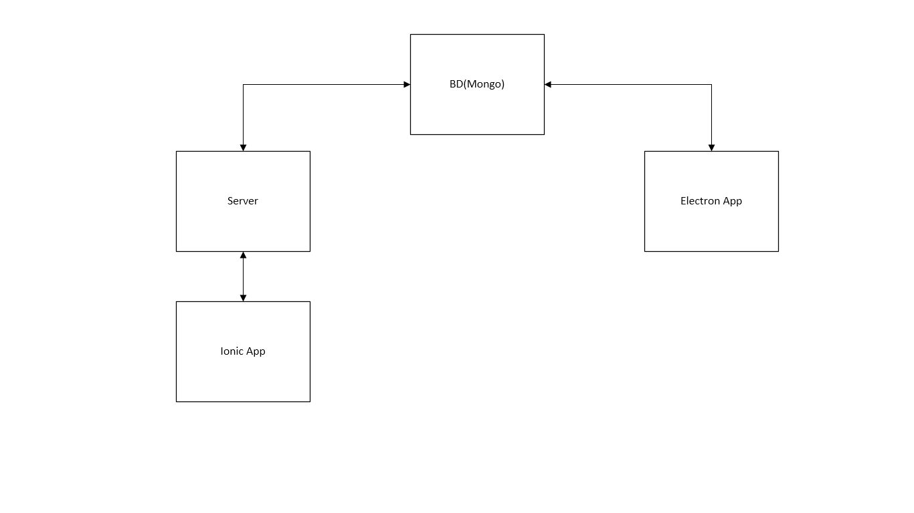

# Minicurso sistema Mean stack

Este Minicurso tem como objetivo guiar você na emocionante jornada de descoberta de duas ferramentas de desenvolvimento - [Ionic] e [Electron].

## Introdução

### Tecnologias
Para este tutorial, é necessário ter instalados e configurados:
* [MongoDB]
* [Node.js]
* [Ionic]
* [Electron]
* [Gulp]

Para que tudo funcione direitinho, é preciso que os binários do `node` e `mongo` estejam adicionados nas variáveis de ambiente.

Para usar o Ionic, você pode seguir as instruções descritas [neste link](http://ionicframework.com/docs/guide/installation.html).

### Por onde começar?
Depois de ter configurado todos as tecnologias, é hora de entender como este tutorial funciona.

Após clonar este repositório, entre na pasta do projeto e, para instalar as dependências, rode os seguintes comandos:
``` sh
npm install
gulp install
```


### O que esse conjunto vai fazer

As aplicações exemplo tem como objetivo mostrar como realizar uma conexão com banco de dados. No caso do Ionic, utilizaremos um servidor em node para alimentar a aplicação, enquanto no caso do Electron, a conexão com o banco será feita de forma direta.

A imagem abaixo apresenta a arquitetura da aplicação.


A estrutura de dados abaixo representa o Schema da nossa [collection](https://docs.mongodb.com/manual/reference/glossary/#term-collection) `users`.
```js
{
  name: String,
  role: String,
  picture: String,
  description: String
}
```


### O Server

Para construir o servidor da aplicação em Ionic, foi utilizada a biblioteca [Xablaujs].

Existem duas maneiras de rodar o server.

1. Executando o comando `gulp server` na raiz do projeto, precisando de uma instancia do MongoDB rodando localmente (`mongod`), sem usuário nem senha.
2. Dentro da pasta `caminho\do\projeto\Server`, execute diretamente com `node index [options]`. Para ver as opções `node index --help`

Para acessar todos os usuários cadastrados no banco de dados, basta acessar a url:
`http://localhost:8080/user`

P.S.: Caso tenha modificado a porta do servidor na linha de comando trocar a porta `8080` para a escolhida por você.

### A aplicação em Electron


### A aplicação em Ionic

[MongoDB]: <https://www.mongodb.com/download-center#community>
[Node.js]: <http://nodejs.org>
[AngularJS]: <http://angularjs.org>
[Gulp]: <http://gulpjs.com>
[Ionic]: <http://ionicframework.com/>
[Electron]: <http://electron.atom.io/>
[Xablaujs]: <https://github.com/vinifig/xablaujs>
